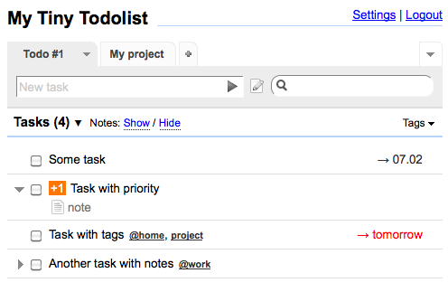

<!--
N.B.: This README was automatically generated by https://github.com/YunoHost/apps/tree/master/tools/README-generator
It shall NOT be edited by hand.
-->

# myTinyTodo pour YunoHost

[](https://dash.yunohost.org/appci/app/mytinytodo)  

[](https://install-app.yunohost.org/?app=mytinytodo)

*[Read this readme in english.](./README.md)*

> *Ce package vous permet d’installer myTinyTodo rapidement et simplement sur un serveur YunoHost.
Si vous n’avez pas YunoHost, regardez [ici](https://yunohost.org/#/install) pour savoir comment l’installer et en profiter.*

## Vue d’ensemble

### Features

- Multiple lists
- Task notes
- Tags (and tag cloud)
- Due dates
- Priority (-1, 0, +1, +2)
- Different sortings including sort by drag-and-drop
- Search
- Password protection
- Smart syntax improves creation of tasks
      (usage: /priority/ Task /tags/)
- Print-friendly CSS
- tyle for mobiles devices 


**Version incluse :** 1.7.3~ynh2

**Démo :** https://www.mytinytodo.net/demo/

## Captures d’écran



## Documentations et ressources

* Site officiel de l’app : <http://www.mytinytodo.net/>
* Documentation officielle de l’admin : <https://www.mytinytodo.net/faq.php>
* Dépôt de code officiel de l’app : <https://github.com/maxpozdeev/mytinytodo>
* Documentation YunoHost pour cette app : <https://yunohost.org/app_mytinytodo>
* Signaler un bug : <https://github.com/YunoHost-Apps/mytinytodo_ynh/issues>

## Informations pour les développeurs

Merci de faire vos pull request sur la [branche testing](https://github.com/YunoHost-Apps/mytinytodo_ynh/tree/testing).

Pour essayer la branche testing, procédez comme suit.

``` bash
sudo yunohost app install https://github.com/YunoHost-Apps/mytinytodo_ynh/tree/testing --debug
ou
sudo yunohost app upgrade mytinytodo -u https://github.com/YunoHost-Apps/mytinytodo_ynh/tree/testing --debug
```

**Plus d’infos sur le packaging d’applications :** <https://yunohost.org/packaging_apps>